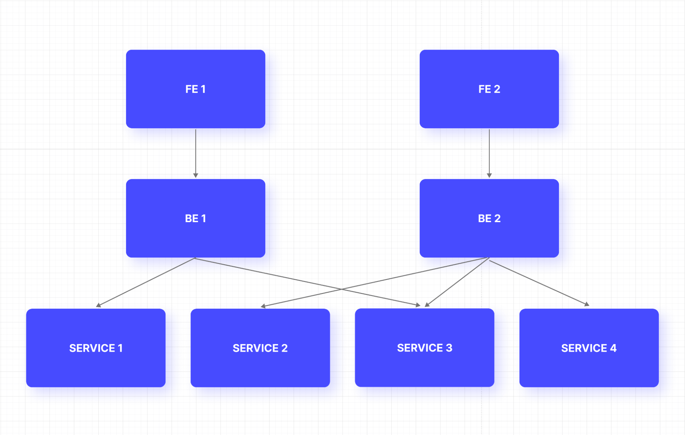

<!-- class: invert -->

# 🤝 Simplificando o Front-end com BFF

### _Backend For Frontend_

---

## 📌 Tópicos

- 🤔 O que é BFF?
- 🚀 Quais problemas resolve?
- 👍 Vantagens
- 👎 Desvantagens
- 🏢 Quem usa?
- ✨ Conclusão
- 📚 Bibliografia

---

## 🤔 O que é BFF?

- Definição básica de BFF e sua função principal.
<!-- 1. BFF é uma camada intermediária entre o front-end e o back-end de uma aplicação web que visa otimizar a comunicação entre as partes. -->

- Como o BFF atua como uma camada intermediária entre o front-end e o back-end.
<!--

2. Na renderização de uma página, o front faria apenas uma requisição para um endpoint específico para aquela página, e o BFF se encarregaria de:

- Cachear informações que podem estar em cache a nível de usuário, cliente ou grupos de clientes;
- Fazer as requisições para os múltiplos serviços;
- Agregar e formatar as informações;

Quando o front-end precisa enviar informações para o back-end, o BFF pode ter o papel de validador. -->

- Destaque para a flexibilidade e personalização oferecidas pelo BFF em relação às necessidades do front-end.
<!--

3. Exemplos:

- Endpoints personalizados: Uma rota por página (?).

- Adaptação de dados: O BFF pode alterar os dados recebidos dos serviços para uma estrutura que faça mais sentido para a página, filtrar informações irrelevantes e combinar informações diferentes em um formato adequado para a interface do usuário.

- Otimização de desempenho: Cache, a agregação de múltiplas chamadas de API em uma única solicitação, e o pré-processamento de dados (tradução).

- Muito mais rápido e menos custoso trocar tecnologias no front-end, como o que fizemos com a plataforma nova, visto que o front fica focado apenas na interface e usabilidade. -->

---

## 🚀 Quais problemas resolve?

1. Over-fetching e under-fetching de dados
<!-- 1. Só trafega o que o front realmente precisa -->
2. Dificuldade de adaptação às necessidades do front-end
<!-- 2. Possibilidade de um endpoint por página e estrutura de dados adaptável ao front -->
3. Complexidade e acoplamento entre front-end e back-end
<!-- 3. O front fica muito mais simples, pois a maior parte da lógica fica no back-end ou no BFF, e o BFF diminui o acoplamento entre o front e o back -->

4. Performance e tempo de resposta
<!-- 4. O front faz menos chamadas para o back e pode haver cache no BFF -->

---

## 👍 Vantagens

1. Agregação de dados

   - Cada página pode receber apenas os dados dos quais precisa.

2. Normalização e adaptação de dados

   - A página recebe os dados traduzidos, ordenados e condensados (podemos combinar informações para gerar um status de uma operação), na estrutura que precisar.
     - Adeus repetir o uso das mesmas funções em diversas páginas para formatar moedas, datas, CNPJ e CPF e etc;

---

## 👍 Vantagens

3. Exposição de endpoints customizados e lógica de negócio no BFF

   - Não precisaríamos de vários dos services no front-end;
   - Poderíamos fazer toda a validação dos dados no BFF, retornando a mensagem de erro que o front deve renderizar em cada caso.

4. Imaginem o quão menores os controllers seriam (isso se não matarmos a maioria) e quantos estados seriam extintos.

---

## 👎 Desvantagens

1. Complexidade adicional, uma nova camada

   - De fato é um item novo pra se preocupar (só é preciso um novo serviço de início, mas no futuro pode ser necessário quebrar em mais de um).
   - Além das novas rotas dos serviço, seria necessário implementar a rota no client do serviço, e o endpoint no BFF com todas as tratativas que antes eram feitas no front.

2. Aumento da complexidade da infraestrutura (?)

   - Se fossemos usar para validação de dados enviados para o back, precisaríamos hospedar esse serviço no Brasil, para que a latência seja mais baixa.

---

## 👎 Desvantagens

3. Potencial SPOF (Single Point Of Failure)

   - Se o BFF enfrentar problemas ou ficar indisponível, todas as solicitações do front-end aos back-ends serão afetadas. Dá-lhe monitoramento para minimizar o impacto de possíveis falhas.

4. Introdução de possíveis gargalos de desempenho
   - Se o BFF não for bem implementado, pode haver a introdução de possíveis gargalos de desempenho (mas aqui seria só uma transferência de um problema que já pode ocorrer no front-end diretamente).

---

## 🏢 Quem usa?

Usado por

- [Netflix](https://netflixtechblog.com/seamlessly-swapping-the-api-backend-of-the-netflix-android-app-3d4317155187)
- [Soundcloud](https://www.thoughtworks.com/insights/blog/bff-soundcloud)
- Flickr

Recomendado por

- [Microsoft](https://learn.microsoft.com/en-us/azure/architecture/patterns/backends-for-frontends)
- [IBM](https://www.ibm.com/cloud/blog/announcements/bluemix-developer-console-bff-backend-for-frontend-pattern)

---

## ✨ Conclusão

- Implementar BFF pode simplificar muito o front, removendo muita lógica do mesmo, e deixando-o focado em uma boa experiência para o usuário.
- Deixa a comunicação do front com o back mais otimizada.
- Desacopla ainda mais o front do back e permite movimentações mais rápidas no front (como trocar um framework).

Mas...

- Introduz um item a mais pra se preocupar;
- Pode ser um SPOF;

- Recapitulação dos principais pontos abordados na apresentação.

---

## Desafios e considerações

- Discussão sobre os possíveis desafios e considerações ao implementar o BFF, como a complexidade da arquitetura.
- Sugestão de boas práticas para superar esses desafios e maximizar os benefícios do BFF.

---

## 📚 Bibliografia

- [Pattern: Backends For Frontends](https://samnewman.io/patterns/architectural/bff/)
- [The BFF Pattern (Backend for Frontend): An Introduction](https://blog.bitsrc.io/bff-pattern-backend-for-frontend-an-introduction-e4fa965128bf)
- [Why big companies and rapidly growing startups need Back-end for Front-end](https://medium.com/blue-harvest-tech-blog/why-big-companies-and-rapidly-growing-startups-need-back-end-for-front-end-ee8e6ab8f575)
- [Make microservices more efficient & scalable with Backend For Frontend: Qiwa tech study](https://tsh.io/blog/backend-for-frontend-microservices/)
