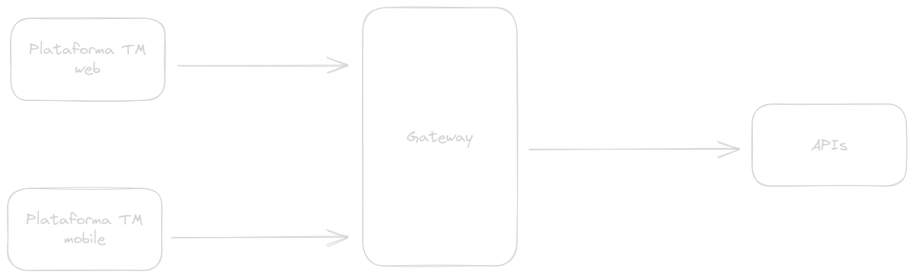
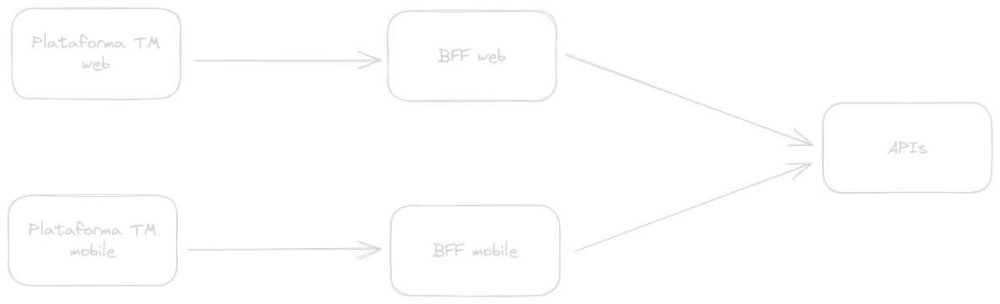

<!-- class: invert -->

# 🤝 Simplificando o frontend com BFF

### ~~Best Friend Forever~~ _Backend For Frontend_

---

## 📌 Tópicos

- 💡 Comparação
- 💭 Definindo em uma frase
- 👍 Vantagens
- 👎 Desvantagens
- 🏢 Quem usa?
- ✨ Conclusão
- 📚 Bibliografia

---

## 💡 Comparação

- Como conhecemos:

---

## 💡 Comparação

- Com BFF:

---

## 💭 Definindo em uma frase

"Serviço cuja a única responsabilidade é atender as necessidades de um determinado frontend"

---

## 👍 Vantagens

1. Menos processamento no cliente;
2. Dados completos e adaptados para cada página com apenas uma chamada HTTP;
3. Cache para todos os clientes;
4. Performance

---

## 👎 Desvantagens

1. Uma falha no BFF pode inutilizar todas as páginas do sistema;
2. Performance;

---

## 🏢 Quem usa?

---

## ✨ Conclusão

- Implementar BFF pode simplificar muito o front, removendo muita lógica do mesmo, e deixando-o focado em uma boa experiência para o usuário.
- Deixa a comunicação do front com o back mais otimizada.

Mas...

- Introduz um item a mais pra se preocupar;
- Pode ser um ponto único de falha;

---

## 📚 Bibliografia

- [Pattern: Backends For Frontends](https://samnewman.io/patterns/architectural/bff/)
- [The BFF Pattern (Backend for Frontend): An Introduction](https://blog.bitsrc.io/bff-pattern-backend-for-frontend-an-introduction-e4fa965128bf)
- [Why big companies and rapidly growing startups need Back-end for Front-end](https://medium.com/blue-harvest-tech-blog/why-big-companies-and-rapidly-growing-startups-need-back-end-for-front-end-ee8e6ab8f575)
- [Make microservices more efficient & scalable with Backend For Frontend: Qiwa tech study](https://tsh.io/blog/backend-for-frontend-microservices/)
